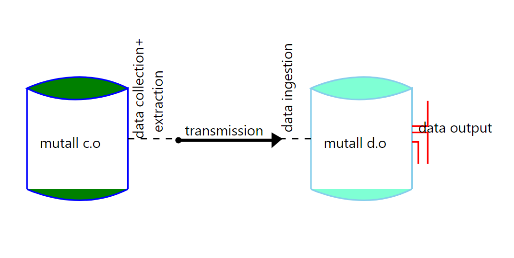

# MUTALL DATA LOADING

## 1. Introduction and concepts

Data loading is the process of data transfer from  

```tex
	1. Excel sheets
    2. Tables
```

 to databases. For these operation, we use a defined library the questionnaire library and the user derived Json layouts.

### 1.1 Diagram

The data loading process is represented as below.



### 1.2 Methods

 In the questionnaire library we have developed three data loading methods there are as follows:

	a. Load: 
	b. Load_common:
	c. Load_user_inputs:

`A. Load`

The is the basic method of data loading. This loading returns a complex data structure which requires encoding thus used where one has the knowledge of how to navigate the report in order to get the result. This is thereby rarely used in most cases of data loading.

`B. Load_common`

This is  the most common method of loading data. Where if successfully completes loading, it returns a string "ok" or errors as a html report. The final report is easy to understand and where errors occur, one can navigate with ease to find out where the problem occurred and how to resolve it.

`C. Load_user_inputs`

This method is used to load data from a user page. Data that comes from a crud page entered by a user.

## 1.3 DESCRIPTION

To transfer data, we develop json based layouts that help in querying of the data to load. These requires a *source* and a *destination*. It can be used for loading both small amounts of data and large amounts regardless of the source of the data.

The source is defined as a table which comprises of a few parameters. The syntax varies from the type of data entry system. Firstly, we'll have a look at the tabular entry.

## 1.4  JSON LAYOUTS

The json files that are used for loading data to databases through the questionnaire library have two parts.

### 1.4.1 TABLE

___

This is data stored in simple tables. For tabular, we have two main parameters. They are as follows:

 1. Class name -  This is the type of query to execute.

    ```
    "class_name": "mutall\\capture\\query",
    ```

    

 2. Args - this are the parameters required by the class name to be able to query for the data. They are:-

    - Tname - The table name to look up for the data.
    - Query - The sql statement to execute on the table above to get the data.
    - Database - The database in which the table is and for getting the data.

```
        "args": [
            "tname",
            "query",
            "database"
        ]
```

### 1.4.2 EXCEL SHEETS

___

This is data stored in formatted sheets in form of csv *(comma separated values)*. It requires two parameters as well. They are as follows:-

​	1. Class name - The type of query to execute.

```
	"class_name": "mutall\\capture\\csv",
```

 2. Args - this are the arguments required to look up for data from the excel sheets. They are as follows:-

    -  Tname -The name of the text table.
    -  Filename - The filename that holds the data.
    -  Cnames - These are the column names where if left empty, the user intends to use the default values as in the data sheet.
    -  Delimiter - This is the operator that is used to separate the data. i.e comma ','.
    -  Header start - Represents the row number which by default starts from 0, where if the number is a negative value, means that the file has no header.
    -  Body start - Represents the row number starting from a value of 0 This indicates where the body of the data starts.

    ```json
            "args":[
                "tname", 
                "filename",
                [cnames],
                "delimiter",  
                header_start,
                body_start
             ]
    ```

### 1.4.3 LABELS

___

 The labels contain the destination of the data. It has 5 parameters with the following structure :-

 	[string, string, [ ], string, basic_value]

 The above represents different values required by the questionnaire in order to load the data. They are as follows:-

​		*1.This contains the database name of where to save the data.*

​		2.*The table name in the database to insert the data.*

​		3.*The alias which is empty when loading to a specific table only. Its however takes the name of the table provided to aid in successful loading of foreign key data.*

​		4.*The column name where the data is to be inserted in the specified table.*

​		5.*The value to save. This may be a simple value or a look up value which is queried from the provided source.*

NB: For look up data, the data is referenced using the structure below.

​	*[ class_name, tname, cname]* 

- The class name is the type of data querying to be performed 	which is the look up from a referenced table.
- The tname is the table to look for the requested data.
- The cname is the column where the data is stored.

For a column name(cname), it varies from one layout to the  other i.e the value in:- 

 - excel is referenced by a number relative to its position starting from 0 e.g.   

```json
["\\capture\\lookup","t1", 0]
```

  - simple tables its referenced by the specific column name e.g.

```json
["\\capture\\lookup","client","name"]
```

This mode of loading can be used to load either a single table a  time or multiple tables at the same time.

## 2. Data Extraction

This has a broad spectrum where the data to be extracted has multiple types of attributes. The attributes are as follows:-

	- Simple or no foreign key attributes.
	- Foreign key / identifier attributes.
	- Hierarchical attributes. 

For all the above, the user needs to  develop a table and  labels to carry out this operation. For the table, a user specifies the type of class name to use from the questionnaire library as below: 

 - for data extracted from a table, the class name is `mutall\\capture\\query` which is used to get the body rows of a table.
 - for data extracted in an excel sheet, the class name is `mutall\\capture\\csv` which is used to get data from text file in the format of a CSV(comma separated values).
 - also there is a class name `mutall\\capture\\fuel` which is used to get data as a 2 dimensional array mostly used to get data from tables in a form.

This is required all through the extraction of data.

### 2.1 Simple Attributes

For simple attributes, the extraction is one to one as the fields selected are equivalent to their destination thus easy to formulate and use. 

For simple attributes, i.e. extracting data from a message table to a similar message table requires the user to get the column names of the table and the JSON will be as below.

#### 2.1.1 Example of extracting simple attributes

The table below is an example to extract data.

##### Message

| msg  | id             | body                                                         | date       |
| ---- | -------------- | ------------------------------------------------------------ | ---------- |
| 1    | Qwdfrr44432224 | The payment was successfully made to the intended recipient. | 05/10/2022 |

For simple attributes, the formulating of the query is direct from the tables attributes. e.g. 

```select 
 select 
 	id,
 	body,
 	date
 from
 	msg
```


First we will need the class name to use and develop a query. The class name will be query as we are getting data from a table. The query will contain the column names of the table excluding the primary key as it is an auto increment field.

```
[{
//
//The class name will be.
"class_name": "mutall\\capture\\query",
//
//The array of arguements are as follows:-
"args": [
	//
	//the table name to query for data.
    "msg",
    //
    //the query statement to execute on the table.
    "select id, body, date from msg",
    //
    //The database name where the table is in.
    "mutallco_rental"
  ]
 }, 
]
```

As shown above, when extracting simple attributes, the alias([ ]) field is left empty as the data has a direct relation and all the data is from the same table.

### 2.2 Foreign keys/ Identifier Attributes

This is the extraction of data that is in multiple tables which have a relation thus the need to extract the foreign key data in order to maintain the data integrity. When selecting the foreign key data, the column used as an identifier is the one required and usually has a key name of 'id'  in the database.

The identifier is used for easy identification and accessing of the data.

#### 2.2.1 Example of Foreign attributes.

Extract data from the water readings table below. Which has a foreign key link to the water meter  and invoicing table.

##### Water meter table

This a simple table with no foreign keys. The identifier column is the `serial_no`.

| wmeter | serial_no | name  | is_supply | comment |
| ------ | --------- | ----- | --------- | ------- |
| 1      | G0000120  | Tap 5 | 1         | null    |

##### Wreading

Has multiple foreign keys which link to the other tables. The links can be either optional or mandatory:- 

- mandatory attributes are required and data can not be inserted without them thus the column does not accept a null value. In the below case, there cannot be water readings without a water meter being related to it.
- optional attributes are not required thus the data can be transferred whether the column value is empty or field. In the below case, the invoice field can only be filled at the end of the month once the invoices are posted as the water readings are done everyday.

| wreading | value | date       | remark        | wmeter | invoice |
| -------- | ----- | ---------- | ------------- | ------ | ------- |
| 1        | 20.45 | 12/10/2022 | first reading | 1      | null    |
| 2        | 25.33 | 13/10/2022 | null          | 1      | null    |

When developing the SQL, one has to resolve the foreign keys by referencing the source table attributes that's the primary identification index.

##### Invoice table

This is a table whose data is generated from other tables once posting is done this its data is dependent on data from other tables. 

| invoice | is_valid | client | period |
| ------- | -------- | ------ | ------ |
| 1       | 1        | 3      | 5      |

For this we will need the class name to use and develop a query. The class name will be query as we are getting data from a table. The query will contain the column names of the table excluding the primary key as it is an auto increment field.

For foreign key attributes, the query has to contain an inner join in order to get the data. The value is selected using a derived word to ease the process of querying as shown in the process below.

```
[{
//The class name.
"classname": "\\mutall\\capture\\query",
//
//The arguements.
"args": [
	//
	//The table to query.
	"wreading",
	//
	//The query statement.
    "select wmeter.serial_no as wmeter_name, wreading.date, wreading.value,
    wreading.remark from wreading inner join wmeter on wreading.wmeter = wmeter.wmeter",
	//
	//The database containing the table.
	"mutallco_rental"
]
},
]
```


### 2.3 Hierarchical Attributes

These are attributes that have a link to a another column in the same table. They are used to record data that references another record, i.e a message and a reply have to be identified hence a message is set in the hierarchical attribute column to set the chain of messages and their replies.

In these attributes, the first value in the hierarchy has a null value.

#### 2.3.1 Example of Hierarchical attributes

Extract data from a table with the hierarchical attributes.

##### Msg

| msg  | id        | text              | date       | child_of |
| ---- | --------- | ----------------- | ---------- | -------- |
| 1    | Greetings | Hello buddy!      | 11/10/2022 | null     |
| 2    | Response  | Hello to you too! | 13/10/2022 | 1        |

The message table has a user defined column `child_of` that's used to record the hierarchical data. To extract this data, the alias helps in extracting the correct value for the attributes.

The process is as below.

```
[{
//
//The class name.
"classname": "\\mutall\\capture\\query",
//
//The arguements.
"args": [
	//
	//The table name to query for data.
	"msg",
	//
	//The query statement to execute on the table.
	"select msg.id, msg.text, msg.date, msg.child_of from msg ",
	//
	//The database with the table.
	"mutall_users"
 ]
},
]
```

Hierarchical data is obtained from within the same table.

### 3. Data Ingestion

This is the inserting of data to the respective destination, this is done through the use of labels which map the data selected from the tables.

#### 3.1 Simple Attributes Ingestion.

 In this case, we'll have an example of the message table from the data extraction section. Reference the above [Message table](#####message).

 For the simple table attributes, there labels are structured as below. 

```
 //
 //The labels of where the data is to be saved. They have 5 parameters:-
 //[1. database name, 2. table name, 3. alias[], 4.column name, 5. expression(value)].
 //
 //Get the id.
 ["rental", "msg", [], "id", ["\\capture\\lookup", "msg", "id"]],
 //
 //Get the body.
 ["rental", "msg", [], "body", ["\\capture\\lookup", "msg", "body"]],
 //
 //Get the date.
 ["rental", "msg", [], "date", ["\\capture\\lookup", "msg", "date"]],
```

In simple attributes, the data is saved in only a single table.

#### 3.2 Foreign key Attributes Ingestion

For this case, we'll use the water reading example from the data extraction section to ingest the data. For reference, visit the [wreading table](#####Wreading). 

For loading the foreign keys, a user needs to to do the saving of the foreign key attributes in their respective tables. i.e. `the water meter is extracted from the wreading and resolved with the identifier from the wmeter.` 

Thereby, when saving the resolved foreign key(mandatory) identifier is the value that's saved as it does not accept a null value whereas the foreign key(optional) that's derived is not saved.

For multiple foreign keys, the saving will occur in as many tables as there are foreign keys in the data extracted. The labels are structured as below:

```
//
//The labels for saving the data.
//
//Get the serial number.Thats saved in the wmeter table rather 
//than the wreading table.
["rentize","wmeter", [],"serial_no", ["\\capture\\lookup","wreading","wmeter_name"]],
//
//Get the date.
["rentize","wreading", [],"date", ["\\capture\\lookup","wreading","date"]],
//
//Get the value.
["rentize","wreading", [],"value", ["\\capture\\lookup","wreading","value"]],
//
//Get the remark.
["rentize","wreading", [],"remark", ["\\capture\\lookup","wreading","remark"]]
```

As the expression in the label is a lookup query, the foreign key value is referenced with the derived name from the extraction statement to get the value for saving. This is adopted in order to identify the values with ease.

#### 3.3 Hierarchical Attributes Ingestion.

 Is data that reference data within the same scope i.e a message and a reply, A message has multiple replies hence to track this chain, a derived attribute `child_of` is used to record this instances.

For successful ingestion of this data, the alias field in the label is used to track and save this data.

```
//
//The labels for saving the data.
//
//Get the id of the message.
["mutall_users", "msg", [ ], "id", [""\\capture\\lookup", "msg", "id"]],
//
//Get the text.
["mutall_users", "msg", [ ], "text", [""\\capture\\lookup", "msg", "text"]],
//
//Get the date.
["mutall_users", "msg", [ ], "date", [""\\capture\\lookup", "msg", date]],
//
//Get the child of info. 
//The alias will contain the column name of the id.???
["mutall_users", "msg", [id], "child_of", [""\\capture\\lookup", "msg", child_of]]
```

The alias helps the user to track the data associated with the provided value. The first value of the hierarchical data has no value. This data has a tree view as each data value references a value above and onwards.

​																																		`Author: Francis Nyakundi`
